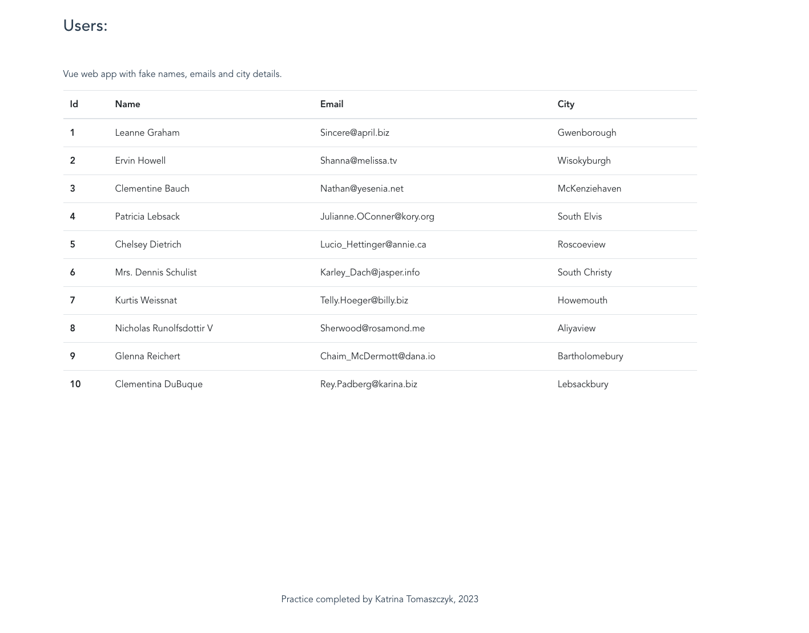

# vueapp

## Introduction
Learning to use vue. This is my first attempt at building a vue app. This is a User's database with fake information. 

Two components: Users, Footer

## Project setup
```
yarn install
```

### Compiles and hot-reloads for development
```
yarn serve
```

### Compiles and minifies for production
```
yarn build
```

### Lints and fixes files
```
yarn lint
```

### Customize configuration
See [Configuration Reference](https://cli.vuejs.org/config/).

### Resources
Following along with tutorial: 

https://www.blog.duomly.com/vue-js-tutorial-how-to-create-vue-js-app-in-5-minutes/

faked API fromJSONPlaceholder website:

https://jsonplaceholder.typicode.com/users/

## Dependencies
* axios 

## Completed Exercise




